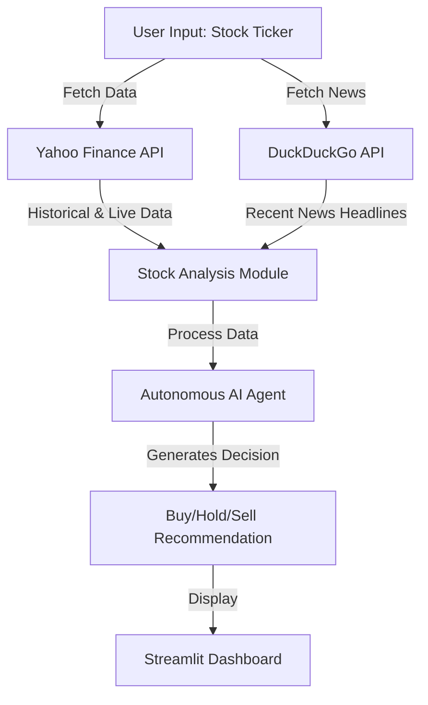

# 📈 AI-Powered Stock Analysis Dashboard with Autonomous Agents  

🚀 **An intelligent stock analysis system that leverages autonomous AI agents and real-time financial data to provide investment insights, price trends, and AI-driven decision support.**  

  

---  

## 🔥 Features  
- **📊 Real-Time Stock Data:** Fetches historical and live stock data using **Yahoo Finance API**.  
- **📉 Interactive Price Charts:** Uses **Plotly** for **candlestick and volume charts**.  
- **📰 AI-Powered News Analysis:** Fetches recent stock news using **DuckDuckGo Search API**.  
- **🧠 Autonomous AI Investment Agents:** Uses **LLMs (Thinking Models)** to generate **Buy/Hold/Sell** recommendations based on financial metrics and market sentiment.  
- **📡 Streamlit Web App:** Interactive and responsive dashboard for seamless analysis.  

---  

## 🛠️ System Architecture  
Below is a high-level workflow of how this system functions:  

---  

## 🚀 Tech Stack  
| Category        | Technologies Used |  
|----------------|------------------|  
| **Languages**  | Python |  
| **Data APIs**  | Yahoo Finance API, DuckDuckGo Search API |  
| **AI & ML**    | LLMs, Retrieval-Augmented Generation (RAG), NLP |  
| **Visualization** | Plotly, Matplotlib |  
| **Web Frameworks** | Streamlit, FastAPI |  
| **Other Tools** | Pandas, NumPy, Scikit-Learn |  

---  

---  

## 🖥️ Usage  
1. Enter a stock ticker symbol in the sidebar (e.g., **NVDA**).  
2. Choose **Overview, Price Charts, or AI Decision Support**.  
3. Click **Analyze Stock** to get real-time insights.  

---  

## 📸 Screenshots  

### 🔹 Stock Overview  
  

### 🔹 Price Charts  
  

### 🔹 AI Decision Support  
  

---  

## 🤖 How AI Agents Work  
The **LLM-based AI agent** analyzes stock data using:  
- **Financial Metrics:** P/E Ratio, Market Cap, Dividend Yield, etc.  
- **Recent News Sentiment:** Extracted from real-time headlines.  
- **LLM Decision Support:** Generates **Buy/Hold/Sell** recommendations.  

 
